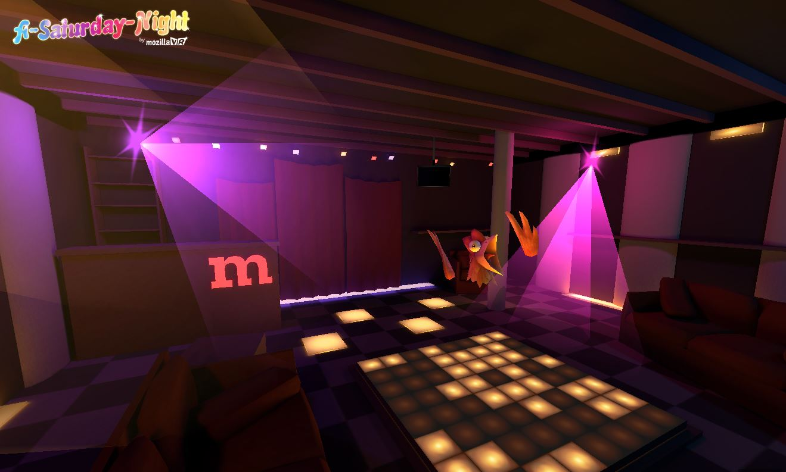

# A-Dancing_Floor

A WebVR dancing experience using [A-Frame](http://aframe.io) by [Mozilla VR](http://mozvr.com). 


<p align="center">
<a href="https://aframe.io/a-saturday-night/"></a>
</p>

## Usage

[](https://aframe.io/a-saturday-night/)

## Local Development

```bash
npm install
npm start
```

Then, load [`http://localhost:8080`](http://localhost:8080) in your browser.

